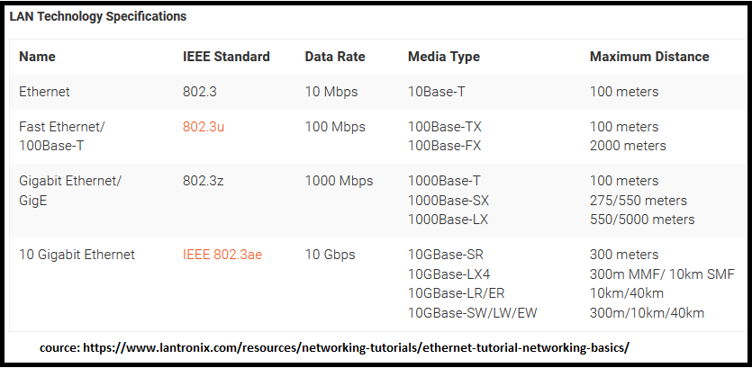
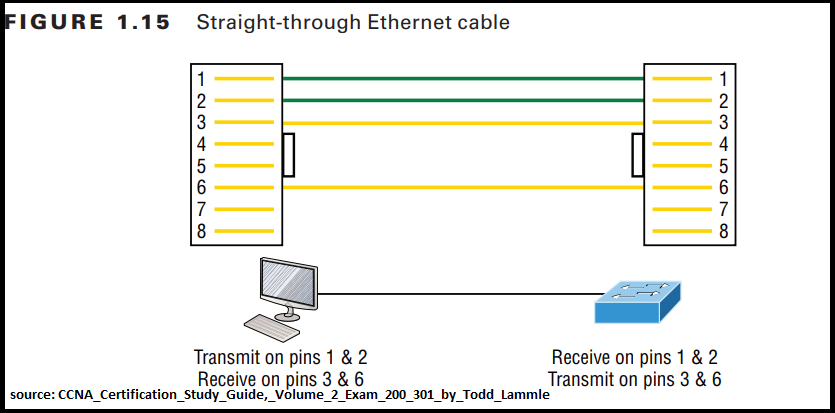
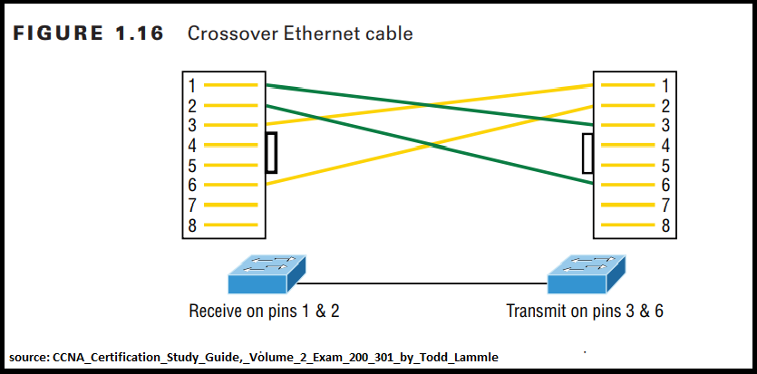
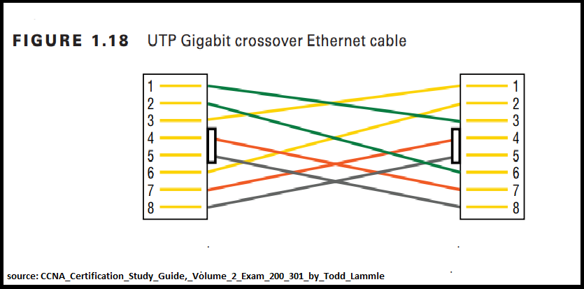
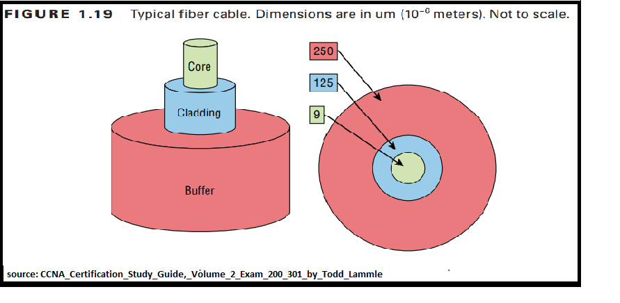

# Cables and Interfaces

Ethernet is a collection of network protocols/standards.

Rj45 -> Rj = Registered Jack

Every Ethernet cable have attenuation (AKA loss of signal strength) which measured in dB.

### Bits and Bytes
8bit=1byte

Speed is measured in bits per seconds (kbps,Mbps,Gbps, ect) Not byte per second.

### Ethernet Standards (copper)
Base=baseband
T-Twisted pair
10Base-T

UTP - Unshielded Twister pair
(Twists protect against Electromagnetic Interference(EMI))

## Key points about 10Base-T, 100Base-T(fastEthernet)
- USE ONLY TWO PAIRS (4 WIRES OR 4 PINS)
### Straight-through cable
When connecting a PC and a switch (or a router and a switch) use 1,2,3 and 6 pins only.

[Use to connect Host to switch or hub / Router to switch or hub]

PC(Router,Firewall) -> pin 1,2 -> Transmit data (Tx)

-> pin 3,6 -> Receive data (Rx)
   
Switch -> pin 1,2 -> Receive data (Rx)

-> pin 3,6 -> Transmit data (Tx)

	   
### Crossover cable
When connecting two PCs (or two routers or two switches) together.

    - Switch to switch

    - Hub to hub

    - Host to host

    - Hub to switch

    - Router direct to host

    - Router to router

Leftside (switch1) -> pin 1,2 -> Receive data (Rx)
                   -> pin 3,6 ->Transmit data (Tx)
				   
Rightside (switch2) -> pin 1,2 -> Receive data (Rx)
                   -> pin 3,6 ->Transmit data (Tx)

				   
Modern networking devices have a feature call "Auto MDI-X" which allows devices to identify which pins and wires their neighbour is using to transmitting and receiving data and adjust their own operations to match.
Ref: Jeremy's IT Lab

### 1000Base-T,10GBase-T
USE ALL 4 PAIRS(8 WIRES OR 8 PINS)
EACH PAIR IS BI-DIRECTIONAL.(EACH PAIR CAN TRANSMIT OR RECEIVE DATA)

## Fiber-Optic Connections
Very fast data transmission.

Made of glass(/plastic).

Very thin.

Long distance support.

Use light/laser to transmit data.

The tighter the cladding, the smaller the core; the smaller the core, the less light sent through it, but it can go faster and farther.

SFP ports
SFP transceiver (Small Form-Factor Pluggable)

### Fiber-Optic pigtail
Pigtail is a piece of fiber with connector installed on one end only and used for terminating fiber by fusion splicing the fiber with a pigtail.

- ### Fiber optic Pigtail Types
Categorized by the connector and fiber types.
Connector types: SC,ST,LC,FC,SMA,MU
Fiber Type: Single mode, Multimode
Ex: SC single mode Pigtail,ST multimode pigtail
https://www.youtube.com/watch?v=pgRbLIE0zao

### Single mode vs Multimode fiber
| SIngle mode      | Multimode                          |
| ----------- | ------------------------------------ |
| More expensive       | Less expensive than single mode.  |
| Has tighter cladding      | Has less tighter cladding compaired to single mode fiber. |
| Smaller code   | Larger core compaired to single mode fiber. |
| More distance | Less distance |

### Fiber-Optic cable standerds 

[Reference: CablExpress](https://www.cablexpress.com/education/white-papers/understanding-fiber-optic-loss-budgets/)

#### IEEE 802.3 10-Gbps Fiber Standards
 
| Standard | Cable type | Max Distance |
| ------ | ------ | ------ |
| 10GBASE-S | MM | 400m |
| 10GBASE-LX4 | MM | 300m |
| 10GBASE-LR | SM | 10km |
| 10GBASE-E | SM | 30km |

### UTP vs Fiber Optic

| UTP      | Fiber                          |
| ----------- | ---------------------------- |
| Less speed       | More speed  |
| Support less bandwidth and distance.      | Support more bandwidth and distance.  |
| Use copper as transmission medium.   | Use glass/plastic as transmission medium. |

[Reference: www.truecable.com](https://www.truecable.com/blogs/cable-academy/fiber-optic-vs-copper#)

## PoE (Power over Ethernet) [802.3af, 802.3at]
PoE = 802.3af

PoE+ = 802.3at

- This technology discribe a system for transmitting power, along with data using standard twisted pair cables.