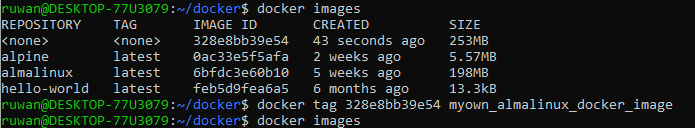

#Docker
##Create own custom docker image
1. Pull any docker image from docker hub
2. In host machine create any file/files you want. I will create index.html file in the myProject directory.
3. Create docker file with the name of "dockerfile"and add below content.

    ````
    FROM <exixting docker container name>
    ````

    ````
    MAINTAINER <your_name_or_email>
    ````

    ````
    RUN yum -y install httpd
    ````
    
    ````
    COPY index.html /var/www/html
    ````

    ````
    EXPOSE 80 443
    ````

    ````
    CMD apachectl -D FOREGROUND
    ````

4. Run "docker build ."
5. After the successfull building run "docker images" and you will get a result like REPOSITORY TAG IMAGE_ID CREATED SIZE. Then tag the newly created docker image using docker tag `<`image_ID`>` `<`image_name`>`.

    

6. Run the newly created docker image using below command.

    ```
    docker run -d -it –name myweb1 -p <hostmachine_ip>:80:80 myown_almalinux_docker_image
    ```

7. To stop the running docker container use the "docker stop `<`container ID`>` command.

Usefull articles and videos.

[Usefull article](https://www.learnitguide.net/2018/06/write-dockerfile-to-build-own-images.html)

[Youtube video](https://www.youtube.com/watch?v=SnSH8Ht3MIc)

##Make persistent changes to a docker image
Scenario: I pull Ubuntu 20.04 from docker hub for test the sudo vulnerability. But packages i have install and changes I have made were not persistent. So I have done below.
First run the docker image. 
```
sudo docker run -it <image_id> /bin/bash
```
Install required packages and make necessary changes.
exit from docker container.
```
sudo docker ps -a
```
Get the container id which I recently used.
Then run below command.
```
sudo docker commit [CONTAINER_ID] [new_image_name]
```