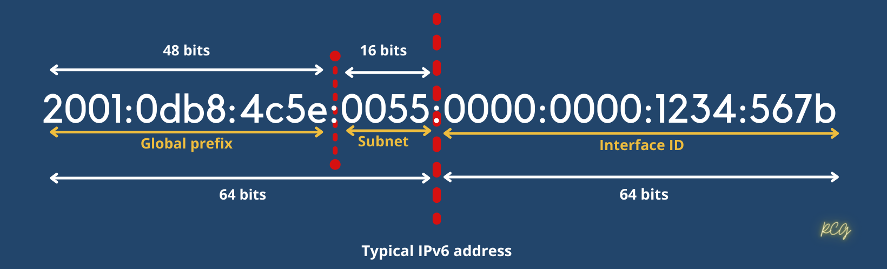

# IPv6

Address space = 3.4 x 10^38 addressess

Size of a address = 128 bits long

IPv6 also allows multiple address for hosts and networks.

Includes an expanded use of multicast communication.(One device sending to many hosts or ta a selected group of hosts. This boots efficiency of networks because communication will be more specific.)

No broadcast (But IPv6 use multicast insted).



2001:0db8:4c5e:0055:0000:0000:1234:567b

## Simple Rules
1. You can drop the leading zeros in each of the individual blocks.
    - 2001:db8:4c5e:55:0:0:1234:567b

2. We can remove the two consecutive blocks of zeros by replacing them with a doubled colon.
``` 
2001:0db8:4c5e:0055:0000:0000:1234:567b into
2001:db8:4c5e:55::1234:567b
```